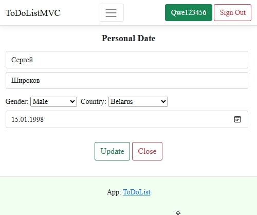
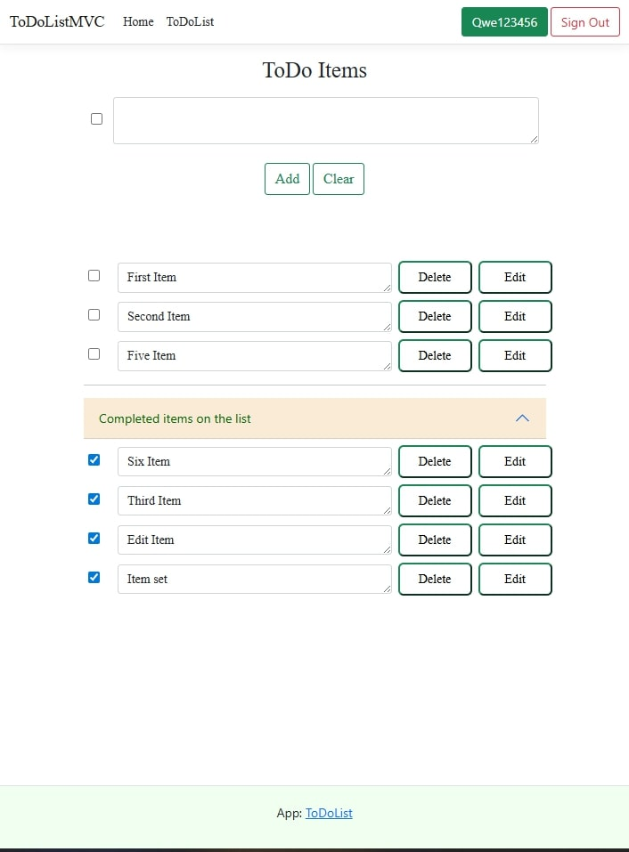
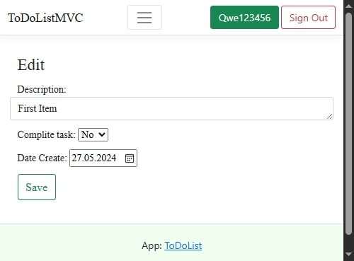

# ToDoList (MVC)

The project is a web application for managing a list of tasks with the Model-View-Controller architecture on the ASP.NET Core platform. Users can register, create, edit and hide completed tasks. The application stores data in SQLite, uses JWT authorization.

## User's personal data: 

  

## ToDoList

  

## Create/Edit item ToDoList 

  

## Technologies:
- Ardalis.SmartEnum v7.0.0;
- Microsoft.AspNetCore.Authentication.JwtBearer v7.0.18;
- Microsoft.AspNetCore.Mvc.TagHelpers v2.2.0;
- Microsoft.EntityFrameworkCore.Sqlite v7.0.16;
- Microsoft.IdentityModel.Protocols.OpenIdConnect v7.5.1;
- Rick.Docs.Samples.RouteInfo v1.0.0.8;
